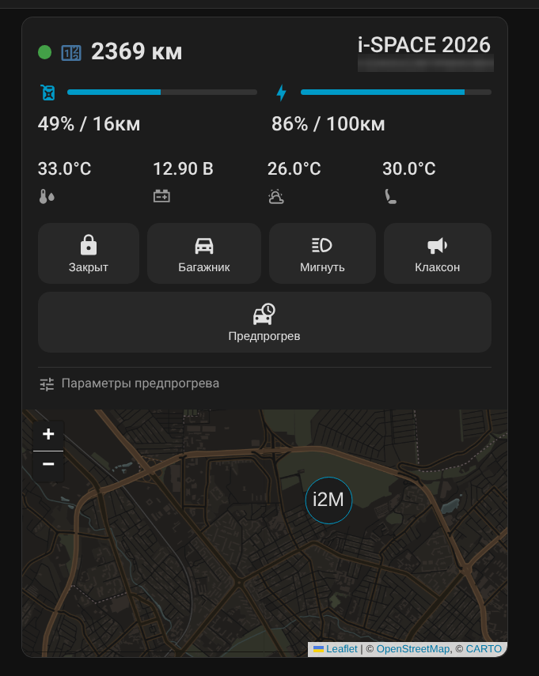

# Evolute Card

[](https://github.com/hacs/integration)
[](https://www.home-assistant.io/)

Универсальная Lovelace-карточка для интеграции
**[evolute-ha](https://github.com/Tamahome-M/evolute-ha)** (Evolute / evassist).
Показывает состояние автомобиля и даёт управление прямо с дашборда.

Карточка **сама находит устройство Evolute** и сопоставляет сущности по их
`translation_key`, поэтому работает на любой машине и в любой локали — править
`entity_id` руками не нужно.

> ⚠️ **Требуется интеграция [evolute-ha](https://github.com/Tamahome-M/evolute-ha) версии 1.1.1+.**
> Без неё карточке нечего показывать — сущности автомобиля создаёт именно интеграция.

## Скриншот

<!-- Замените на реальный скриншот карточки перед публикацией -->


## Возможности

- Одометр + индикатор онлайн, модель и VIN.
- Полосы заряда батареи и топлива с остатком хода.
- Температуры (ОЖ, снаружи, в салоне) и напряжение 12В.
- Управление: центральный замок, багажник, сигнал и фары («Поиск» — звук +
  моргание), предпрогрев (вкл/выкл).
- Панель параметров предпрогрева: целевая температура, длительность, подогрев
  4 сидений и руля — отправляются одной командой `PREPARE`.
- Строка «Время данных» — когда машина в последний раз прислала телеметрию.
- Опциональная карта местоположения.

## Установка через HACS

[](https://my.home-assistant.io/redirect/hacs_repository/?owner=Tamahome-M&repository=evolute-card&category=dashboard)

1. HACS → три точки → **Custom repositories**.
2. URL: `https://github.com/Tamahome-M/evolute-card`, категория **Dashboard**.
3. Найдите «Evolute Card», нажмите **Download**, обновите страницу (Ctrl+F5).

HACS сам добавит ресурс. Если добавляете `.js` вручную (без HACS):
**Настройки → Панели → ⋮ → Ресурсы →** добавить
`/hacsfiles/evolute-card/evolute-card.js` как **JavaScript-модуль**.

## Использование

Минимально — карточка сама найдёт машину:

```yaml
type: custom:evolute-card
```

Со всеми опциями:

```yaml
type: custom:evolute-card
show_map: true        # показать карту местоположения (по умолчанию выкл.)
map_height: 250       # высота карты, px
prepare_open: false   # раскрыть панель параметров предпрогрева сразу
hide_prepare: false   # полностью скрыть панель предпрогрева
device: abcd1234...   # device_id — только если у вас несколько машин Evolute
```

### Несколько автомобилей

Если интеграция добавлена для нескольких машин, укажите `device` (его `device_id`
есть в URL страницы устройства: **Настройки → Устройства → ваша машина**).

## Требования

- Интеграция **[evolute-ha](https://github.com/Tamahome-M/evolute-ha)** 1.1.1+.
- Home Assistant 2024.1 или новее.

## Лицензия

MIT
